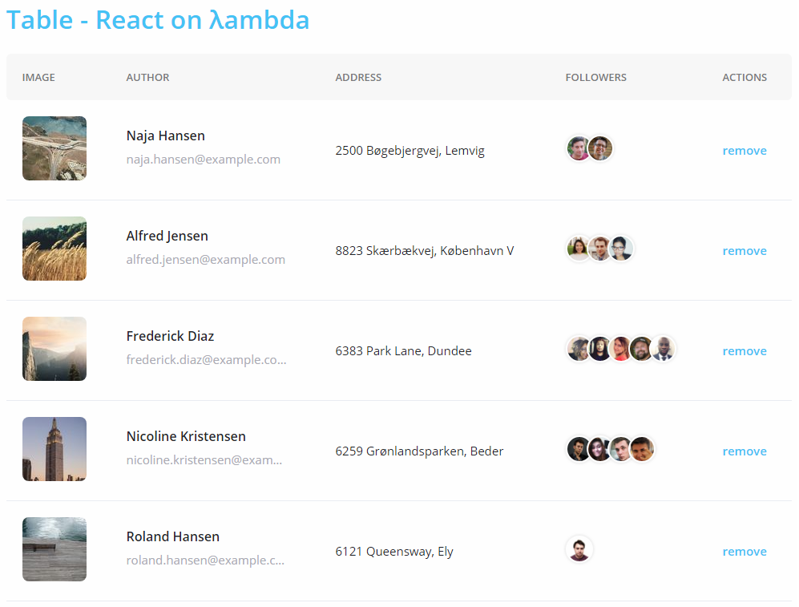

## Demo project
Application is written using [react on lambda](https://github.com/sultan99/react-on-lambda).
Live demo at [codesandbox](https://codesandbox.io/s/jjlo9m5jq5)



<br/>

## Getting started
Don't warry be magic 🧙‍

🧙‍ Three magic commands to get the project:
```sh
$ git clone git@github.com:sultan99/rol-table.git
$ cd rol-table
$ npm i
```
<br/>

🧙‍ Two magic words to start:
```sh
$ npm start
```
<br/>

🧙 One magic link to get involved: [http://localhost:8080](http://localhost:8080/)
<br/>
<br/>

## Build
🧙‍ Three magic words to build:
```sh
$ npm run build
```
<br/>

Check `dist` folder for output.
